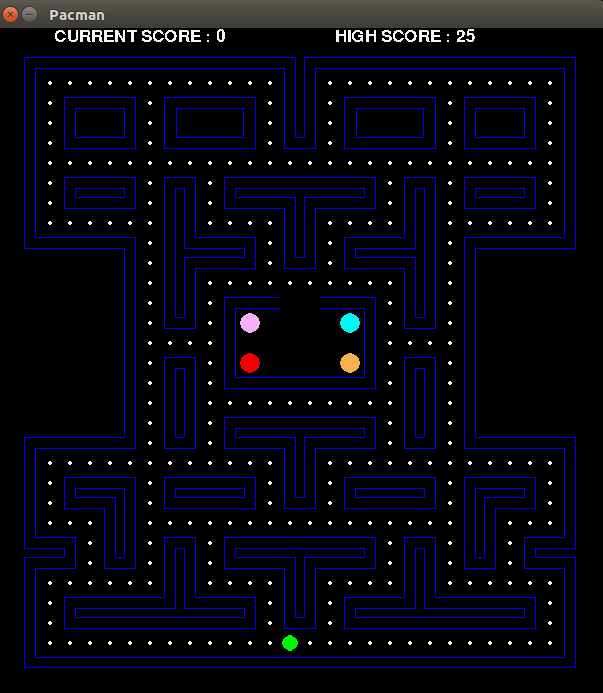

# Pacman

## Table of Contents
1. [Introduction](#introduction)
2. [Future Development](#future-development)

## Introduction
This is an implementation of the classical Pacman game. The game consists of a single level in which the player can be controlled using the arrow keys. Three of the four ghosts are integrated with the A* PathFinding algorithm whereas the last ghost traverses randomly. All the ghosts have different speeds! 

## Future Development
Adding a reinforcement learning agent to the player.
